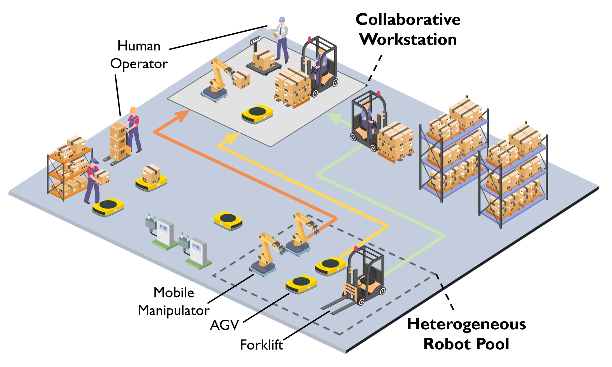
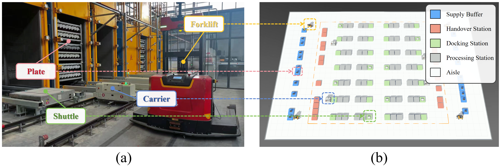
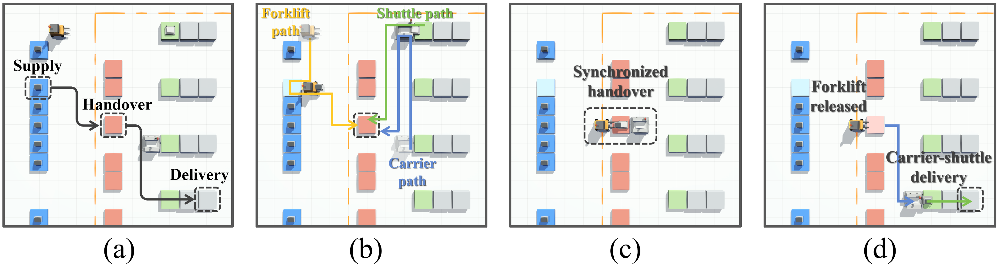
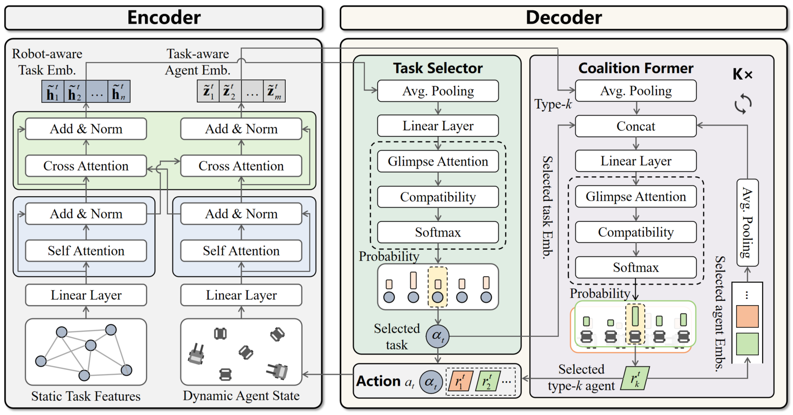

# Co-HeT: A Transformer-based Deep Reinforcement Learning Approach for Collaborative Heterogeneous Robot Scheduling

[](LICENSE)
[](https://www.python.org/)
[](https://pytorch.org/)

This repository contains the official implementation and baseline algorithms for the paper: **"Co-HeT: A Transformer-based Deep Reinforcement Learning Approach for Collaborative Heterogeneous Robot Scheduling"**.

---

## 📌 Overview

Modern smart manufacturing and logistics increasingly involve coupled operations that cannot be completed by a single robot type. In a smart warehouse, forklifts, AGVs, mobile manipulators, and human operators may need to coordinate at collaborative workstations, where each task can start only after all required robot types are present and available.

Co-HeT studies **Collaborative Heterogeneous Robot Scheduling Problems (CHRSP)**, a class of problems that abstracts this workflow into synchronized scheduling of functionally heterogeneous robot coalitions. This repository provides the proposed model, adapted DRL baselines, traditional exact and metaheuristic baselines, benchmark and real-world instances, visualization media, and pretrained checkpoints.

<p align="center">
  
  <br>
  <em>Fig. 1. A smart warehouse scenario involving synchronized collaboration among functionally heterogeneous robots.</em>
</p>

The main challenge is the tight coupling among task allocation, heterogeneous coalition formation, and execution sequencing. These coupled decisions create a large combinatorial action space, strict spatiotemporal synchronization constraints, cross-schedule dependencies, and potential deadlocks. Co-HeT reformulates CHRSP as an MDP with composite task-coalition actions and learns a constructive policy for synchronized schedule generation.

## 🎥 Visualization Demo

To intuitively illustrate the collaborative mechanism, we provide a visualization of Co-HeT solving a medium-scale instance with 50 coupled tasks, coordinated by 4 Type-1 robots and 8 Type-2 robots.


https://github.com/user-attachments/assets/416931c4-035d-4d8c-8656-922a7488da59


The animation shows the complete lifecycle of collaborative task execution under strict synchronization constraints:

- **Asynchronous arrival and waiting.** When the first required robot reaches a task location, the task enters a waiting state until its heterogeneous partner arrives.
- **Synchronized execution.** A task starts execution only when all required robot types are simultaneously present and available.
- **Completion and departure.** After execution is completed, the assigned robots are released and proceed to subsequent scheduled tasks.

## 🏭 Industrial Case Study

We further evaluate Co-HeT on an industrial battery plate transfer case. The system involves a carrier, a shuttle, and a forklift, which must coordinate across supply, handover, docking, and processing stations under synchronized task requirements.

<p align="center">
  
  <br>
  <em>Fig. 2. Industrial battery plate transfer system and its Webots-based simulation layout.</em>
</p>

The workflow is summarized as follows:

- **Coordinated dispatching.** The forklift retrieves plates while the carrier-shuttle pair moves to the handover station.
- **Synchronized handover.** The three robots meet at the handover station and execute the coupled transfer task.
- **Delivery after release.** After the forklift is released, the carrier-shuttle pair completes the downstream delivery.

<p align="center">
  
  <br>
  <em>Fig. 3. Collaborative transfer task execution from task-point specification to synchronized handover and delivery.</em>
</p>

The following Webots-based video demonstrates the full industrial workflow and the corresponding coordinated robot execution.


https://github.com/user-attachments/assets/58425bd4-60c6-4ba6-9c6b-2504260f516b


## 🧠 Model Architecture

Co-HeT is a Transformer-based encoder-decoder policy network for task-coalition scheduling. Rather than selecting only the next task, it constructs the complete heterogeneous robot coalition required for synchronized execution.

<p align="center">
  
  <br>
  <em>Fig. 4. Architecture of the Co-HeT policy network.</em>
</p>

The model is organized around two components.

- **Dual-stream encoder with mutual contextual fusion.** Task features and robot states are embedded by separate attention streams, then exchanged through task-to-robot and robot-to-task contextual attention.
- **Hierarchical collaborative decoder.** The decoder first selects the next task and then autoregressively forms the required robot coalition under feasibility masks and synchronization constraints.

This design aligns the policy with CHRSP by making task decisions aware of robot availability and conditioning coalition formation on the selected task.

## ⚙️ Installation

Validate the recommended environment specification:

```bash
conda env create -f environment.yml --dry-run
```

To use the repository, create an environment from `environment.yml` and activate it with your local Conda workflow. If using an existing environment, install the core dependencies manually:

```bash
python -m pip install torch numpy pandas tqdm openpyxl tensorboard_logger
```

The checkpoint and video files are tracked with Git LFS:

```bash
git lfs install
git lfs pull
```

## 🗂️ Repository Structure

```text
methods/
  learning/
    cohet/              Proposed Co-HeT model
    am/                 Adapted Attention Model baseline
    hdrl/               Adapted HDRL baseline
    tdrl/               Adapted TDRL baseline
    mvmoe/              Adapted MVMoE baseline
    echo/               Adapted ECHO baseline
  conventional/         Gurobi exact solver and ALNS/IGA/DABC/DIWO metaheuristics

checkpoints/
  cohet|am|hdrl|tdrl|mvmoe|echo/
    type_2|type_3/
      size_10|size_20|size_50|size_100/
  real_world/
    cohet|am|hdrl|tdrl|mvmoe|echo/
      size_10|size_20|size_30|size_40/

instances/
  synthetic/            Synthetic benchmark instances for two and three robot types
  robustness/           Spatial and temporal robustness test instances
  real_world/           Industrial real-world case-study instances

scripts/
  eval_drl.py           Unified DRL evaluation entry point
  train_drl.py          Unified DRL training entry point
  run_conventional.py   Unified conventional baseline runner
  benchmark_all.py      Batch benchmark runner
  method_registry.py    Method and path registry used by wrapper scripts

docs/figures/           README and paper illustration figures
media/                  Collaborative execution and real-world Webots videos
```

## 🚀 Evaluate Co-HeT

Greedy decoding on a 20-task, two-robot-type checkpoint:

```bash
python scripts/eval_drl.py \
  --method cohet \
  --robot_type 2 \
  --dataset Synthetic_Dataset \
  --model checkpoints/cohet/type_2/size_20 \
  --decode_strategy greedy \
  --eval_batch_size 1 \
  --val_size 1 \
  --no_progress_bar \
  -f
```

Sampling with 1280 candidate solutions on one instance:

```bash
python scripts/eval_drl.py \
  --method cohet \
  --robot_type 2 \
  --dataset Synthetic_Dataset \
  --model checkpoints/cohet/type_2/size_20 \
  --decode_strategy sample \
  --width 1280 \
  --eval_batch_size 1 \
  --val_size 1 \
  --no_progress_bar \
  -f
```

To evaluate another scale or robot-type setting, change the checkpoint folder:

```text
checkpoints/cohet/type_2/size_10
checkpoints/cohet/type_2/size_50
checkpoints/cohet/type_2/size_100
checkpoints/cohet/type_3/size_20
checkpoints/cohet/type_3/size_100
```

The dataset family is resolved automatically from `--robot_type` and the checkpoint size.

## 🧪 Evaluate DRL Baselines

The repository includes CHRSP-adapted DRL baselines under the same reward, action space, data generation process, and inference protocol:

- **AM**: attention model baseline with CHRSP task-coalition decoding.
- **HDRL**: preserves history-aware dispatching and route-context modeling.
- **TDRL**: preserves token-style state coding and recurrent dynamic token updates.
- **MVMoE**: introduces sparse mixture-of-experts layers into an AM-style architecture.
- **ECHO**: preserves dual-modality task encoding and historical-resource-aware decoding.

Quick evaluation examples:

```bash
python scripts/eval_drl.py \
  --method am \
  --robot_type 2 \
  --dataset Synthetic_Dataset \
  --model checkpoints/am/type_2/size_20 \
  --decode_strategy greedy \
  --eval_batch_size 1 \
  --val_size 1 \
  --no_progress_bar \
  -f

python scripts/eval_drl.py \
  --method mvmoe \
  --robot_type 3 \
  --dataset Synthetic_Dataset \
  --model checkpoints/mvmoe/type_3/size_50 \
  --decode_strategy sample \
  --width 1280 \
  --eval_batch_size 1 \
  --val_size 1 \
  --no_progress_bar \
  -f

python scripts/eval_drl.py \
  --method echo \
  --robot_type 2 \
  --dataset Synthetic_Dataset \
  --model checkpoints/echo/type_2/size_20 \
  --decode_strategy sample \
  --width 1280 \
  --eval_batch_size 1 \
  --val_size 1 \
  --no_progress_bar \
  -f
```

## 🏋️ Train DRL Models

Run a lightweight Co-HeT training check:

```bash
python scripts/train_drl.py \
  --method cohet \
  --robot_type 2 \
  --graph_size 20 \
  --n_epochs 1 \
  --epoch_size 128 \
  --batch_size 64 \
  --val_size 64 \
  --eval_batch_size 64 \
  --no_tensorboard \
  --no_progress_bar \
  --run_name smoke_cohet_type2_20
```

Run lightweight checks for the adapted DRL baselines:

```bash
python scripts/train_drl.py --method am    --robot_type 2 --graph_size 20 --n_epochs 1 --epoch_size 128 --batch_size 64 --val_size 64 --eval_batch_size 64 --no_tensorboard --no_progress_bar --run_name smoke_am_type2_20
python scripts/train_drl.py --method hdrl  --robot_type 2 --graph_size 20 --n_epochs 1 --epoch_size 128 --batch_size 64 --val_size 64 --eval_batch_size 64 --no_tensorboard --no_progress_bar --run_name smoke_hdrl_type2_20
python scripts/train_drl.py --method tdrl  --robot_type 2 --graph_size 20 --n_epochs 1 --epoch_size 128 --batch_size 64 --val_size 64 --eval_batch_size 64 --no_tensorboard --no_progress_bar --run_name smoke_tdrl_type2_20
python scripts/train_drl.py --method mvmoe --robot_type 2 --graph_size 20 --n_epochs 1 --epoch_size 128 --batch_size 64 --val_size 64 --eval_batch_size 64 --no_tensorboard --no_progress_bar --run_name smoke_mvmoe_type2_20
python scripts/train_drl.py --method echo  --robot_type 2 --graph_size 20 --n_epochs 1 --epoch_size 128 --batch_size 64 --val_size 64 --eval_batch_size 64 --no_tensorboard --no_progress_bar --run_name smoke_echo_type2_20
```

Additional training arguments are forwarded to the method-specific `run.py`. A minimal smoke test can be launched as:

```bash
python scripts/train_drl.py \
  --method cohet \
  --robot_type 2 \
  --graph_size 20 \
  --n_epochs 1 \
  --epoch_size 512 \
  --batch_size 128 \
  --val_size 128 \
  --eval_batch_size 128 \
  --no_tensorboard \
  --no_progress_bar \
  --run_name smoke_cohet
```

For larger instances, encoder checkpointing can reduce GPU memory usage:

```bash
python scripts/train_drl.py \
  --method cohet \
  --robot_type 3 \
  --robot_type_num 3 \
  --graph_size 100 \
  --n_epochs 1 \
  --epoch_size 8 \
  --batch_size 8 \
  --val_size 8 \
  --eval_batch_size 8 \
  --checkpoint_encoder \
  --no_tensorboard \
  --no_progress_bar \
  --run_name smoke_cohet_type3_100
```

## 🧩 Conventional Baselines

The repository packages the exact and metaheuristic baselines used in the paper for reproducibility and further adaptation:

- `gurobi`: Gurobi MILP solver.
- `alns`: Adaptive Large Neighborhood Search.
- `iga`: Iterated Greedy Algorithm.
- `dabc`: Discrete Artificial Bee Colony.
- `diwo`: Discrete Invasive Weed Optimization.

Inspect the packaged conventional baseline wrapper:

```bash
python scripts/run_conventional.py --help
```

The packaged conventional implementations preserve their original research-code structure. Running a full exact or metaheuristic baseline may require editing or extending the corresponding scripts under `methods/conventional/`. Metaheuristic settings and operator details are summarized in `docs/metaheuristic_baselines.md`.

## 📊 Batch Benchmark

Run a lightweight batch benchmark over selected DRL methods:

```bash
python scripts/benchmark_all.py \
  --dataset Synthetic_Dataset \
  --methods cohet \
  --robot_types 2 \
  --decode_strategies greedy \
  --eval_batch_size 1 \
  --val_size 1 \
  --sizes 10 \
  --out_prefix results/comparison/readme_smoke \
  --no_cuda \
  --no_progress_bar
```

The script writes:

```text
results/comparison/readme_smoke.csv
```

The `results/` directory is created automatically when evaluation or benchmark scripts are executed.

## ✅ Reproducibility Checks

Compile all Python sources:

```bash
python -m compileall methods scripts
```

Run a minimal CPU checkpoint loading test:

```bash
python scripts/eval_drl.py \
  --method cohet \
  --robot_type 2 \
  --dataset Synthetic_Dataset \
  --model checkpoints/cohet/type_2/size_20 \
  --decode_strategy greedy \
  --eval_batch_size 1 \
  --val_size 1 \
  --no_progress_bar \
  -f \
  --no_cuda
```

## 🙏 Acknowledgements

We thank the authors of the following open-source projects, which served as important references for the learning-based baselines adapted in this repository:

- **AM**: [wouterkool/attention-learn-to-route](https://github.com/wouterkool/attention-learn-to-route)
- **HDRL**: [chenmingxiang110/tsp_solver](https://github.com/chenmingxiang110/tsp_solver)
- **TDRL**: [Vision-Intelligence-and-Robots-Group/ToDRL](https://github.com/Vision-Intelligence-and-Robots-Group/ToDRL)
- **MVMoE**: [RoyalSkye/Routing-MVMoE](https://github.com/RoyalSkye/Routing-MVMoE)
- **ECHO**: [wuuu110/echo](https://github.com/wuuu110/echo)

We also acknowledge the exact and metaheuristic baselines, including Gurobi, ALNS, IGA, DABC, and DIWO, which are adapted to the same CHRSP setting for fair comparison.
