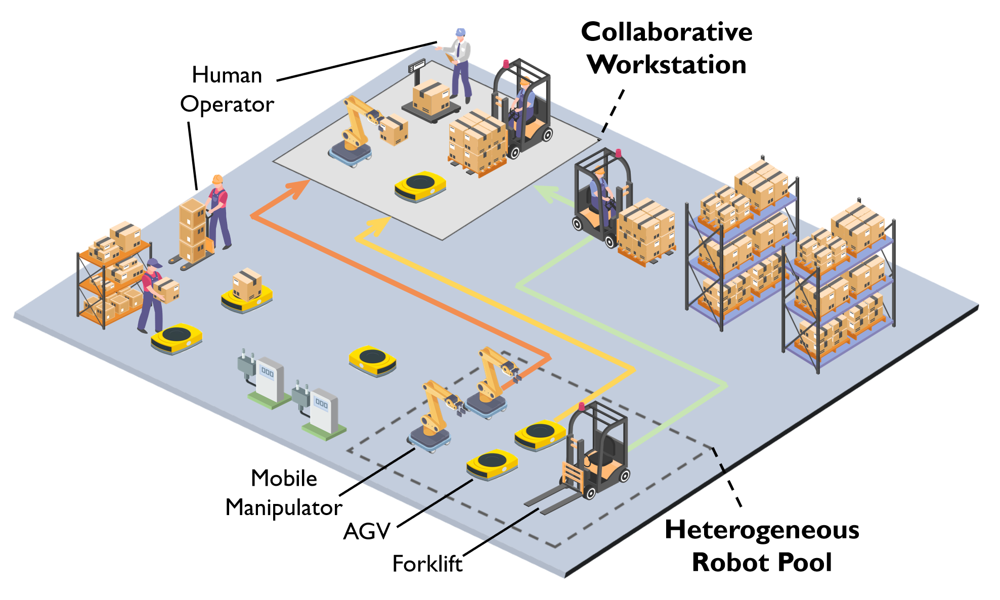
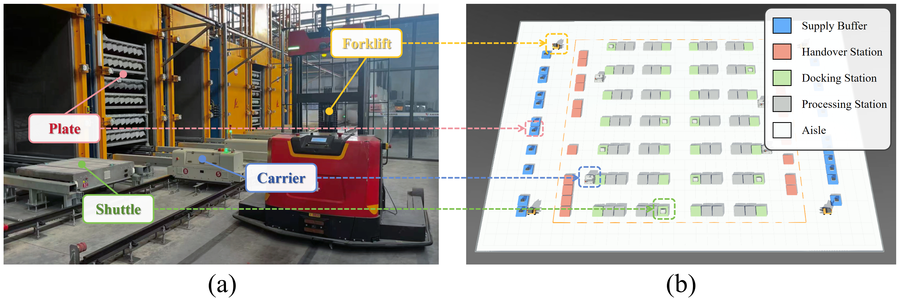
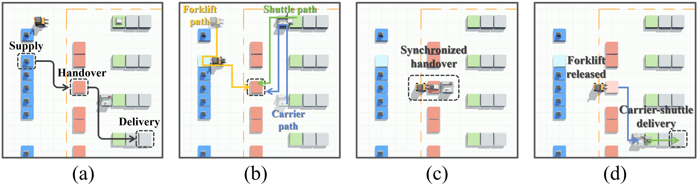
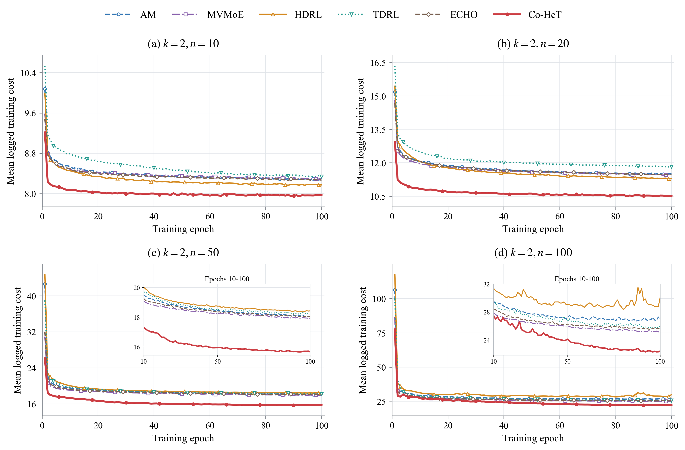
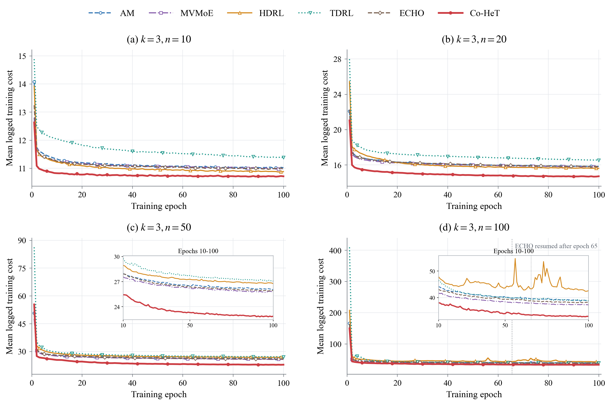
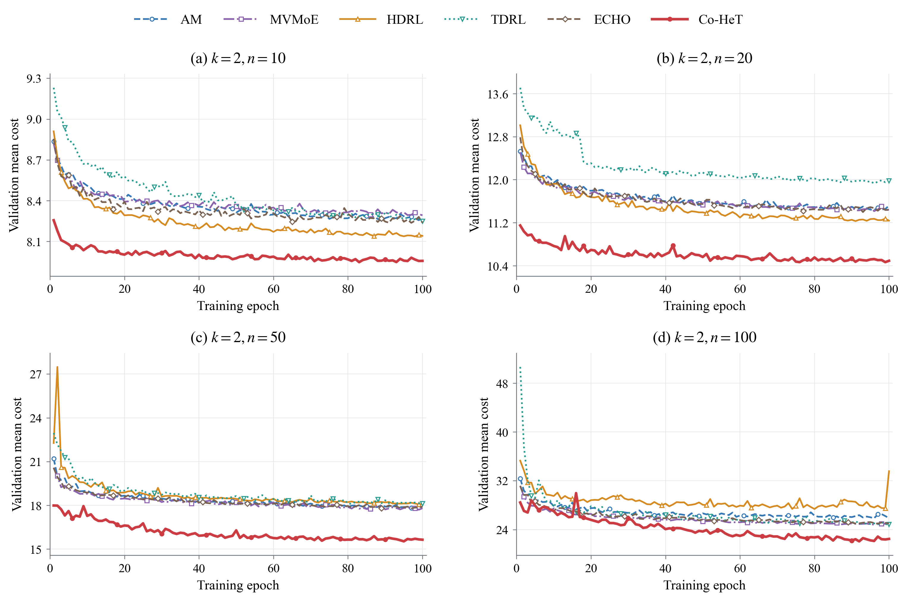
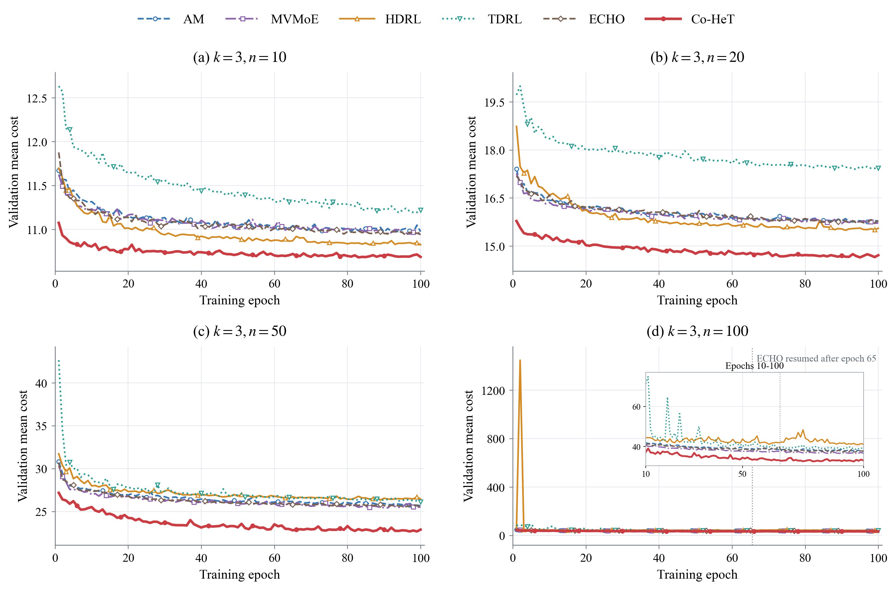

# Co-HeT: A Transformer-based Deep Reinforcement Learning Approach for Collaborative Heterogeneous Robot Scheduling

[](LICENSE)
[](https://www.python.org/)
[](https://pytorch.org/)

This repository contains the official implementation and baseline algorithms for the paper: **"Co-HeT: A Transformer-based Deep Reinforcement Learning Approach for Collaborative Heterogeneous Robot Scheduling"**.

---

## 📌 Overview

Modern smart manufacturing and logistics increasingly involve coupled operations that cannot be completed by a single robot type. In a smart warehouse, forklifts, AGVs, mobile manipulators, and human operators may need to coordinate at collaborative workstations, where each task can start only after all required robot types are present and available.

Co-HeT studies **Collaborative Heterogeneous Robot Scheduling Problems (CHRSP)**, a class of problems that abstracts this workflow into synchronized scheduling of functionally heterogeneous robot coalitions. This repository provides the proposed model, adapted DRL baselines, MILP and metaheuristic baselines, synthetic benchmark and industrial simulation instances, visualization media, and pretrained checkpoints.

<p align="center">
  
  <br>
  <em>Fig. 1. A smart warehouse scenario involving synchronized collaboration among functionally heterogeneous robots.</em>
</p>

The main challenge is the tight coupling among task allocation, heterogeneous coalition formation, and execution sequencing. These coupled decisions create a large combinatorial action space, strict spatiotemporal synchronization constraints, cross-schedule dependencies, and potential deadlocks. Co-HeT reformulates CHRSP as an MDP with composite task-coalition actions and learns a constructive policy for synchronized schedule generation.

## 🎥 Visualization Demo

To intuitively illustrate the collaborative mechanism, we provide a visualization of Co-HeT solving a medium-scale instance with 50 coupled tasks, coordinated by 4 Type-1 robots and 8 Type-2 robots.


<div align="center">
  <video src="https://github.com/user-attachments/assets/416931c4-035d-4d8c-8656-922a7488da59" controls autoplay loop muted></video>
</div>


The animation shows the complete lifecycle of collaborative task execution under strict synchronization constraints:

- **Asynchronous arrival and waiting.** When the first required robot reaches a task location, the task enters a waiting state until its heterogeneous partner arrives.
- **Synchronized execution.** A task starts execution only when all required robot types are simultaneously present and available.
- **Completion and departure.** After execution is completed, the assigned robots are released and proceed to subsequent scheduled tasks.

## 🏭 Industrial Simulation Case Study

We further evaluate Co-HeT in a simulation based on an industrial battery plate transfer scenario. The simulated system involves a carrier, a shuttle, and a forklift, which coordinate across supply, handover, docking, and processing stations under synchronized task requirements. Quantitative results come from the industrial scheduling simulator; Webots visualizes the workflow. These experiments assess scheduling performance under the modeled conditions and do not provide physical-robot deployment validation.

The benchmark uses 100 generated test instances at each of 10, 20, 30 and 40 tasks. All six DRL methods are retrained on industrially parameterized simulation data at each scale. The [industrial experiment guide](docs/experiments/industrial/README.md) describes generation rules, simulation parameters, model training and result coverage.

<p align="center">
  
  <br>
  <em>Fig. 2. (a) Industrial battery plate transfer scenario used as context; (b) corresponding Webots simulation layout.</em>
</p>

The workflow is summarized as follows:

- **Coordinated dispatching.** The forklift retrieves plates while the carrier-shuttle pair moves to the handover station.
- **Synchronized handover.** The three robots meet at the handover station and execute the coupled transfer task.
- **Delivery after release.** After the forklift is released, the carrier-shuttle pair completes the downstream delivery.

<p align="center">
  
  <br>
  <em>Fig. 3. Simulated collaborative transfer task execution in Webots, from task-point specification to synchronized handover and delivery.</em>
</p>

The following Webots video illustrates coordinated robot execution in the simulated industrial workflow.


<div align="center">
  <video src="https://github.com/user-attachments/assets/58425bd4-60c6-4ba6-9c6b-2504260f516b" controls autoplay loop muted></video>
</div>


## 🧠 Model Architecture

Co-HeT is a Transformer-based encoder-decoder policy network for task-coalition scheduling. Rather than selecting only the next task, it constructs the complete heterogeneous robot coalition required for synchronized execution.

<p align="center">
  <a href="docs/figures/architecture.pdf">
    
  </a>
  <br>
  <em>Fig. 4. Architecture of the Co-HeT policy network.</em>
</p>

The model is organized around two components.

- **Dual-stream encoder with mutual contextual fusion.** Task features and robot states are embedded by separate attention streams, then exchanged through task-to-robot and robot-to-task contextual attention.
- **Hierarchical collaborative decoder.** The decoder first selects the next task and then autoregressively forms the required robot coalition under feasibility masks and synchronization constraints.

This design aligns the policy with CHRSP by making task decisions aware of robot availability and conditioning coalition formation on the selected task.

## ⚙️ Installation

Use Python 3.10 and install the core dependencies from `environment.yml`. The examples use the Conda environment `my310env`:

```bash
conda env create -n my310env -f environment.yml
```

Gurobi is optional for learning methods and offline analysis. To run the MILP baseline, install `gurobipy` in the same environment and configure your own valid Gurobi license. No license is included.

Checkpoint and video files use Git LFS when published through Git:

```bash
git lfs install
git lfs pull
```

Local copies already containing full `.pt` files do not require an LFS download. See [reproducibility](docs/reproducibility.md) for recorded settings and [the checkpoint guide](checkpoints/README.md) for model selection.

## 🗂️ Repository Structure

```text
methods/
  learning/
    cohet/              Proposed Co-HeT model
    am/                 Adapted Attention Model baseline
    hdrl/               Adapted HDRL baseline
    tdrl/               Adapted TDRL baseline
    mvmoe/              Adapted MVMoE baseline
    echo/               Adapted ECHO baseline
  real_world/           Industrial simulation DRL environments
  conventional/         Gurobi MILP and ALNS/IGA/DABC/DIWO metaheuristics

checkpoints/
  cohet|am|hdrl|tdrl|mvmoe|echo/
    type_2|type_3/
      size_10|size_20|size_50|size_100/
  real_world/
    cohet|am|hdrl|tdrl|mvmoe|echo/
      size_10|size_20|size_30|size_40/

instances/
  synthetic/            Synthetic benchmark and spatial/temporal robustness instances
  real_world/           Earlier industrial simulation instances
  real_world_test100_seed20260906/  Industrial simulation test set (400 instances)

scripts/
  eval_drl.py           Unified DRL evaluation entry point
  train_drl.py          Unified DRL training entry point
  run_conventional.py   Unified conventional baseline runner
  benchmark_all.py      Batch benchmark runner
  method_registry.py    Method and path registry used by wrapper scripts

docs/experiments/       Main comparison and industrial per-instance results
docs/figures/           README and paper illustration figures
scripts/analysis/       Main comparison and industrial result reconstruction
scripts/industrial/     Industrial training and evaluation entry points
media/                  Collaborative execution animations and industrial Webots simulation videos
```

## Synthetic Distance Contract

All robots start at the depot and finish after their last assigned task, without a return trip. Unused robots have empty routes. Travel uses Manhattan distance:

```text
d(i, j) = abs(x_i - x_j) + abs(y_i - y_j)
J = lambda * total_travel_time + (1 - lambda) * total_tardiness
```

The synthetic reference speed is 1, so travel time and Manhattan distance have the same numerical value in the benchmark units. The main setting uses `lambda = 0.5`; weight sensitivity covers `0.1, 0.2, ..., 0.9`, with eight additional models and reuse of the main model at 0.5. Industrial travel time uses the separate carrier and forklift speeds described in [industrial settings](docs/experiments/industrial/README.md).

Composite task–coalition actions synchronize the required functional types and avoid partial coalition allocation. The scheduling model does not include collision avoidance, shared-space contention, communication delays, dynamic arrivals, or failures during execution.

## 🚀 Evaluate Co-HeT

Greedy decoding on a 20-task, two-robot-type checkpoint:

```bash
conda run -n my310env python scripts/eval_drl.py \
  --method cohet \
  --robot_type 2 \
  --dataset Synthetic_Dataset \
  --model checkpoints/cohet/type_2/size_20 \
  --decode_strategy greedy \
  --eval_batch_size 1 \
  --val_size 1 \
  --no_progress_bar \
  -f
```

Sampling with 1280 candidate solutions on one instance:

```bash
conda run -n my310env python scripts/eval_drl.py \
  --method cohet \
  --robot_type 2 \
  --dataset Synthetic_Dataset \
  --model checkpoints/cohet/type_2/size_20 \
  --decode_strategy sample \
  --width 1280 \
  --eval_batch_size 1 \
  --val_size 1 \
  --no_progress_bar \
  -f
```

To evaluate another scale or robot-type setting, change the checkpoint folder:

```text
checkpoints/cohet/type_2/size_10
checkpoints/cohet/type_2/size_50
checkpoints/cohet/type_2/size_100
checkpoints/cohet/type_3/size_20
checkpoints/cohet/type_3/size_100
```

The dataset family is resolved automatically from `--robot_type` and the checkpoint size.

## 🧪 Evaluate DRL Baselines

The repository includes CHRSP-adapted DRL baselines under the same reward, action space, data generation process, and inference protocol:

- **AM**: attention model baseline with CHRSP task-coalition decoding.
- **HDRL**: preserves history-aware dispatching and route-context modeling.
- **TDRL**: preserves token-style state coding and recurrent dynamic token updates.
- **MVMoE**: introduces sparse mixture-of-experts layers into an AM-style architecture.
- **ECHO**: preserves dual-modality task encoding and historical-resource-aware decoding.

Quick evaluation examples:

```bash
conda run -n my310env python scripts/eval_drl.py \
  --method am \
  --robot_type 2 \
  --dataset Synthetic_Dataset \
  --model checkpoints/am/type_2/size_20 \
  --decode_strategy greedy \
  --eval_batch_size 1 \
  --val_size 1 \
  --no_progress_bar \
  -f

conda run -n my310env python scripts/eval_drl.py \
  --method mvmoe \
  --robot_type 3 \
  --dataset Synthetic_Dataset \
  --model checkpoints/mvmoe/type_3/size_50 \
  --decode_strategy sample \
  --width 1280 \
  --eval_batch_size 1 \
  --val_size 1 \
  --no_progress_bar \
  -f

conda run -n my310env python scripts/eval_drl.py \
  --method echo \
  --robot_type 2 \
  --dataset Synthetic_Dataset \
  --model checkpoints/echo/type_2/size_20 \
  --decode_strategy sample \
  --width 1280 \
  --eval_batch_size 1 \
  --val_size 1 \
  --no_progress_bar \
  -f
```

## 🏋️ Train DRL Models

The n=20, k=2 Co-HeT reference configuration is:

```bash
conda run -n my310env python scripts/train_drl.py --method cohet --robot_type 2 --graph_size 20 --n_epochs 100 --epoch_size 1280000 --batch_size 1024 --val_size 10000 --eval_batch_size 1024 --seed 1234 --run_name cohet_n20_k2_seed1234
```

Change `--method` to `am`, `hdrl`, `tdrl`, `mvmoe` or `echo` to select its implementation. Additional arguments are forwarded to its `run.py`. The example applies only to Co-HeT at n=20, k=2; use each model's adjacent `args.json` to preserve its actual batch size, precision and other training settings.

For an optional short training check:

```bash
conda run -n my310env python scripts/train_drl.py --method cohet --robot_type 2 --graph_size 20 --n_epochs 1 --epoch_size 128 --batch_size 64 --val_size 64 --eval_batch_size 64 --no_tensorboard --no_progress_bar --run_name smoke_cohet
```

Encoder checkpointing can be selected with `--checkpoint_encoder` to reduce memory use. Training commands start computation and create new outputs.

### Training Convergence

The following figures show the epoch-wise mean logged training cost of the six methods for 10, 20, 50 and 100 tasks. Lower values indicate lower training cost. Model-specific training settings are provided with the [checkpoints](checkpoints/README.md).

<p align="center">
  <a href="docs/figures/training_convergence_k2_4scales.png"></a>
  <br>
  <em>Training convergence with two functional robot types (&kappa; = 2).</em>
</p>

<p align="center">
  <a href="docs/figures/training_convergence_k3_4scales.png"></a>
  <br>
  <em>Training convergence with three functional robot types (&kappa; = 3).</em>
</p>

### Validation Convergence

The following figures show the validation mean cost across training epochs for the six methods at 10, 20, 50 and 100 tasks. Lower values indicate better validation performance.

<p align="center">
  <a href="docs/figures/validation_convergence_k2_4scales.png"></a>
  <br>
  <em>Validation convergence with two functional robot types (&kappa; = 2).</em>
</p>

<p align="center">
  <a href="docs/figures/validation_convergence_k3_4scales.png"></a>
  <br>
  <em>Validation convergence with three functional robot types (&kappa; = 3).</em>
</p>

## 🧩 Conventional Baselines

The repository packages the following exact and metaheuristic baselines. See the [baseline guide](methods/conventional/README.md) for algorithm settings:

- `gurobi`: Gurobi MILP solver.
- `alns`: Adaptive Large Neighborhood Search.
- `iga`: Iterated Greedy Algorithm.
- `dabc`: Discrete Artificial Bee Colony.
- `diwo`: Discrete Invasive Weed Optimization.

Check a conventional baseline configuration and its input data:

```bash
conda run -n my310env python scripts/run_conventional.py --solver alns N20_K2_M12_I1 --dry-run
```

The entry point accepts an instance name or a selection of scales and instances. Removing `--dry-run` starts computation. The [baseline guide](methods/conventional/README.md) describes stopping conditions, repetitions, solver settings and resuming a run.

## 📊 Batch Benchmark

Run a lightweight batch benchmark over selected DRL methods:

```bash
conda run -n my310env python scripts/benchmark_all.py \
  --dataset Synthetic_Dataset \
  --methods cohet \
  --robot_types 2 \
  --decode_strategies greedy \
  --eval_batch_size 1 \
  --val_size 1 \
  --sizes 10 \
  --out_prefix results/comparison/readme_smoke \
  --no_cuda \
  --no_progress_bar
```

The script writes:

```text
results/comparison/readme_smoke.csv
```

The `results/` directory is created automatically when evaluation or benchmark scripts are executed.

## Experimental Results

Per-instance results are provided for the [main comparison](docs/experiments/main_comparison/README.md) and [industrial simulation case study](docs/experiments/industrial/README.md). Their pages describe the data columns and commands for rebuilding the result tables.

[Baseline adaptations](docs/method_adaptations.md) and [reproducibility notes](docs/reproducibility.md) describe the model settings, datasets and objective definitions.

## 🙏 Acknowledgements

We thank the authors of the following open-source projects, which served as important references for the learning-based baselines adapted in this repository:

- **AM**: [wouterkool/attention-learn-to-route](https://github.com/wouterkool/attention-learn-to-route)
- **HDRL**: [chenmingxiang110/tsp_solver](https://github.com/chenmingxiang110/tsp_solver)
- **TDRL**: [Vision-Intelligence-and-Robots-Group/ToDRL](https://github.com/Vision-Intelligence-and-Robots-Group/ToDRL)
- **MVMoE**: [RoyalSkye/Routing-MVMoE](https://github.com/RoyalSkye/Routing-MVMoE)
- **ECHO**: [wuuu110/echo](https://github.com/wuuu110/echo)

We also acknowledge the exact and metaheuristic baselines, including Gurobi, ALNS, IGA, DABC, and DIWO, which are adapted to the same CHRSP setting for fair comparison.
